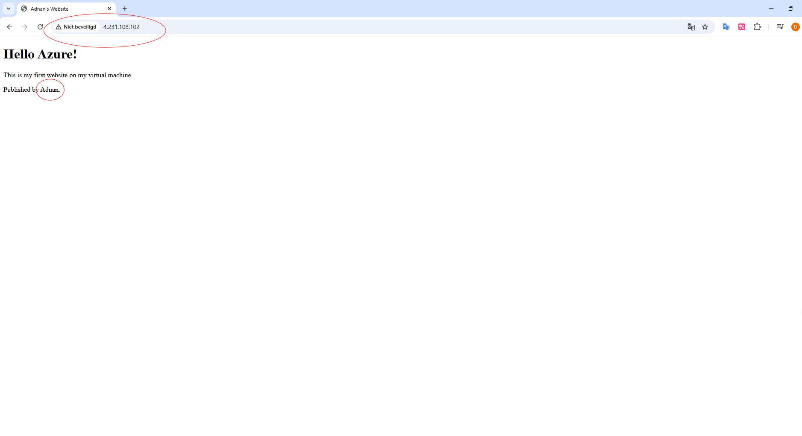

# Adnan_Vit_7_Team_4_Azure_Project
Azure Virtuele Machine en Bestandsdeling Beheer Project

### **1. Gedetailleerde Beschrijving van Projectstappen**

In dit gedeelte zal ik de processen voor het creëren van een virtuele machine en bestandsdeling in Azure stap voor stap toelichten. Elke stap wordt ondersteund met relevante screenshots.

**1.1. Creatie van de Resourcegroep**
* **Doel:** Alle gerelateerde Azure-resources samenbrengen en het beheer vereenvoudigen.
* **Stappen:**
    * Ingelogd op de Azure Portal.
    * Een resourcegroep aangemaakt. (Bijvoorbeeld: de resourcegroep `adnan_vit_7` is aangemaakt.)
    

**1.2. Creatie en Initiële Configuratie van de Virtuele Machine**
* **Doel:** Een cloudgebaseerde virtuele computeromgeving bieden.
* **Stappen:**
    * Binnen de `adnan_vit_7` resourcegroep is een Windows Server virtuele machine met de naam `adnanVM` aangemaakt.
    * Een geschikte grootte en regio (`West Europe`) zijn gekozen voor de virtuele machine.
    * Een beheerdersgebruikersnaam en wachtwoord zijn ingesteld.
    * De inkomende RDP-poort (3389) is toegestaan.

**1.3. Verbinding Maken met de Virtuele Machine en Initiële Taken**
* **Doel:** Externe toegang tot de virtuele machine mogelijk maken en benodigde software installeren.
* **Stappen:**
    * Het RDP-bestand is gedownload via de overzichtspagina van de virtuele machine en er is verbinding gemaakt.
    * Hieronder is de RDP verbindingspoging te zien, inclusief een beveiligingswaarschuwing.
    
    * SQL Server Express (15.0.2000) is geïnstalleerd op de virtuele machine.
    * Met behulp van SQL Server Management Studio (SSMS) is een database met de naam `AdnanOdevDB` aangemaakt.
    * **Code voor het Aanmaken van de Database:**
        De volgende T-SQL-code is gebruikt om de database te creëren:
        ```sql
        CREATE DATABASE AdnanOdevDB;
        ```
    * De succesvolle aanmaak van de database in SSMS wordt hieronder getoond.
        
    * Een eenvoudige webpagina (`Hello Azure! This is my first website on my virtual machine. Published by Adnan.`) is gemaakt en gepubliceerd op IIS (Internet Information Services), waarna deze toegankelijk was via het openbare IP-adres (4.231.108.102).
    

**1.4. Creatie en Gebruik van Azure Bestandsdeling**
* **Doel:** Gegevens opslaan in de cloud en deze toegankelijk maken vanaf de virtuele machine.
* **Stappen:**
    * Een nieuw opslagaccount is aangemaakt (Bijvoorbeeld: `adnanopslag`).
    * Binnen dit opslagaccount is een Azure Bestandsdeling (Azure File Share) aangemaakt (Bijvoorbeeld: `adnanodev`).
    
    * **Azure Bestandsdeling Verbinden als Netwerkstation met de Virtuele Machine:**
        * De PowerShell-opdracht, beschikbaar gesteld via het "Verbinden" (Connect) gedeelte van de `adnanodev` bestandsdeling in de Azure Portal (voor Windows), is gekopieerd.
        * Op de virtuele machine is PowerShell als administrator geopend en de gekopieerde opdracht is geplakt en uitgevoerd. Hierdoor is de bestandsdeling als een netwerkstation (bijvoorbeeld `Z:`) gekoppeld aan de virtuele machine.
        ```powershell
        # Voorbeeld PowerShell-commando (Dit zal lijken op het commando dat u vanuit de Azure Portal heeft gekopieerd)
        $connectTestResult = Test-NetConnection -ComputerName "adnanopslag.file.core.windows.net" -Port 445
        if ($connectTestResult.TcpTestSucceeded) {
            # Als de letter al in gebruik is, kies dan een andere
            $choice = Get-PSDrive -PSProvider FileSystem | Where-Object {$_.Name -eq "Z"}
            if ($choice) {
                Write-Host "Station Z: is al in gebruik. Kies alstublieft een andere stationsletter."
            } else {
                net use Z: \\adnanopslag.file.core.windows.net\adnanodev /user:AZURE\adnanopslag "YOUR_STORAGE_ACCOUNT_KEY"
                Write-Host "Azure Bestandsdeling is verbonden als Z:."
            }
        } else {
            Write-Error "Poort 445 kon niet worden geopend. Controleer alstublieft uw netwerkbeveiligingsgroep."
        }
        ```
    * Het succesvol gekoppelde netwerkstation in de virtuele machine wordt hieronder getoond.
    
    * De inhoud van de gekoppelde netwerkmap is direct toegankelijk.
    

### **2. Ervaren Problemen en Oplossingen**

In dit gedeelte worden de uitdagingen die tijdens het project zijn ondervonden en de toegepaste oplossingen gedetailleerd beschreven.

**2.1. SQL Server Verbindingsfout: Onbetrouwbare Certificaatketen**
* **Probleem:** Bij het verbinden met SQL Server Express, geïnstalleerd op de virtuele machine, werd de foutmelding "The certificate chain was issued by an authority that is not trusted." (De certificaatketen is uitgegeven door een onbetrouwbare autoriteit.) ontvangen. De RDP-verbinding liet ook een soortgelijke certificaatwaarschuwing zien.
* **Oplossing:** Deze fout wordt doorgaans veroorzaakt doordat SQL Server een zelfondertekend (self-signed) certificaat gebruikt. Dit is een veelvoorkomend probleem in ontwikkel- of testomgevingen. Hoewel het uit veiligheidsoogpunt niet aanbevolen wordt, kan het tijdelijk worden omzeild door in de verbindingsinstellingen de optie "Trust server certificate" (Servercertificaat vertrouwen) aan te vinken of de optie "Encrypt connection" (Verbinding versleutelen) uit te schakelen. Aangezien de virtuele machine aan het einde van het project is verwijderd, is in dit stadium geen permanente oplossing voor deze fout toegepast.

**2.2. Fouten bij het Verwijderen van de Resourcegroep (wegens Recovery Services Vault)**
* **Probleem:** Pogingen om de `adnan_vit_7` resourcegroep te verwijderen, mislukten omdat de `vault-mcuth8jz` Recovery Services Vault het verwijderen van de resourcegroep blokkeerde.

* **Oplossingsstappen:**
    * **Controle van Vergrendelingen:** Aanvankelijk werd gedacht dat er een vergrendeling op de resourcegroep zou kunnen zijn. De resourcegroep had echter geen expliciete vergrendelingen, zoals bevestigd in de instellingen.

    * **Status Virtuele Machine:** Er werd bevestigd dat er geen virtuele machines meer waren om weer te geven, wat betekende dat de VM zelf geen belemmering was voor het verwijderen van de resourcegroep.

    * **Uitschakelen van "Voorlopig Verwijderen" (Soft Delete):**
        * Navigeerde naar de "Eigenschappen" (Properties) onder "Beveiligingsinstellingen" (Security Settings) van de Recovery Services Vault.
      
        * De vinkjes bij de opties "Voorlopig verwijderen inschakelen..." (Enable soft delete...) werden verwijderd en de instellingen werden opgeslagen door te klikken op "Bijwerken" (Update). Dit maakte het mogelijk om de back-upitems permanent uit de vault te verwijderen.
     
    * **Opschonen van "Back-upitems" (Backup Items):**
        * Navigeerde naar de detailpagina van het `adnanodev` back-upitem binnen de vault.
        * Via de optie "Back-up stoppen" (Stop backup) werd de actie "Back-upgegevens verwijderen" (Delete backup data) geselecteerd.
        * `adnanodev` werd ingevoerd ter bevestiging en de operatie werd gestart.
    
        * De melding van de succesvolle activering van de verwijdering wordt hieronder getoond.
    
        * Er werd geverifieerd dat de lijst "Back-upitems" volledig leeg was.
 
    * **Controle van "Back-upbeleid" (Backup Policy):** Actieve back-upbeleiden in de vault werden gecontroleerd en indien aanwezig verwijderd.
    * **Verwijderen van "Back-upinfrastructuur" (Backup Infrastructure) Koppelingen:**
        * Gezien de waarschuwing over actieve servers en opslagaccounts gekoppeld aan de vault, werd naar het gedeelte "Back-upinfrastructuur" genavigeerd.
 
        * Hier werd het `adnanopslag` opslagaccount als "Geregistreerd" (Registered) aangetroffen.
        * Via de drie puntjes (...) en de optie "Registratie ongedaan maken" (Unregister) werd de koppeling van `adnanopslag` verwijderd.


**2.3. Succesvolle Verwijdering van Resources**
* **Oplossing:** Nadat alle bovengenoemde afhankelijkheden uit de vault waren verwijderd:
    * Eerst is de `vault-mcuth8jz` Recovery Services Vault succesvol verwijderd.
    * Vervolgens zijn de `adnan_vit_7` resourcegroep en alle resterende resources (sanal machine, depolage account, Recovery Services-kluis, netwerkcomponenten, etc.) binnenin deze groep succesvol verwijderd.
    

### **3. GitHub Repository Link**

[Link naar uw GitHub Repository met Projectrapport en Code Hier]
*(Zorg ervoor dat uw repository openbaar is.)*

### **4. LinkedIn Deellink (Optioneel)**

[Link naar uw LinkedIn-post Hier]
*(Vergeet niet om relevante hashtags zoals #Azure, #VirtueleMachine, #CloudComputing in uw LinkedIn-post te gebruiken en uw docent te taggen.)*
